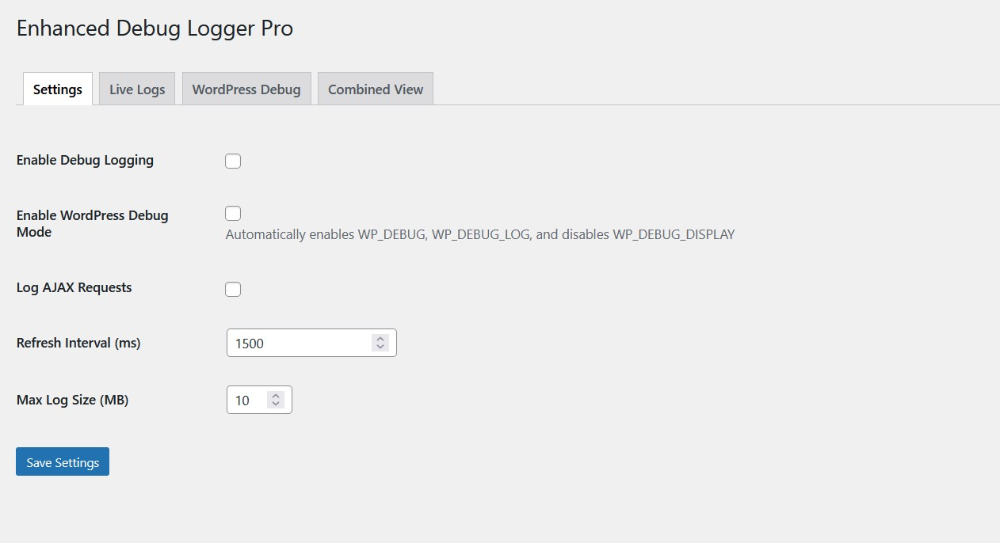
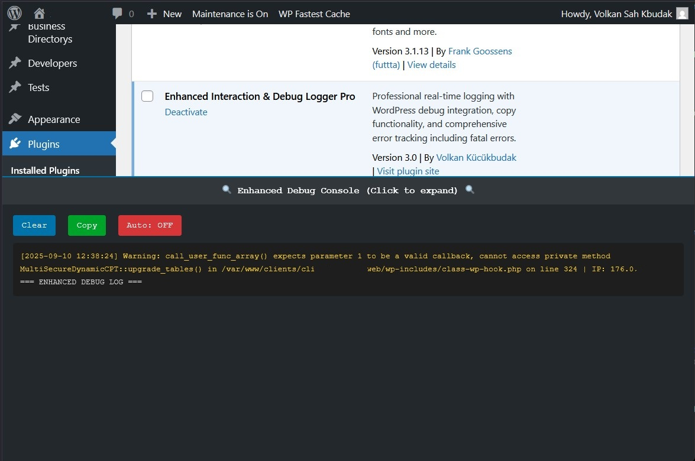

# Enhanced Interaction & Debug Logger Pro


## Description

**Enhanced Interaction & Debug Logger Pro** is a professional WordPress debugging plugin that captures everything - from simple page requests to fatal PHP errors. Born from frustration with bloated monitoring tools and debug bars that slow down development, this plugin provides a lightweight, comprehensive logging solution.

**Why this plugin exists:** After dealing with overloaded debug bars, heavy monitoring apps, and tools that miss critical errors (especially fatal errors during plugin installations), I decided to enhance my original logging tool with the help of Claude 4 Sonnet to create something that actually works when you need it most.

## Key Features

### 🔥 **Fatal Error Detection**
- **Catches PHP Fatal Errors** that crash your site during plugin testing
- **Shutdown Function Handler** captures errors that other tools miss
- **Plugin Installation Crashes** are now logged and traceable

### 🚀 **Professional Logging**
- **Real-time WordPress Debug Integration** - automatically enables WP_DEBUG when needed
- **Combined Log Views** - see your custom logs AND WordPress debug-log.txt in one place
- **Copy-to-Clipboard Functionality** - finally works properly with modern browsers
- **Color-coded Error Levels** - Fatal errors in red, warnings in orange, notices in yellow

### 🎯 **Smart Console**
- **Expandable Console** appears on both frontend and admin
- **Auto-refresh with pause/resume** controls
- **Tab-based Interface** for different log types
- **Auto-scroll to latest entries** option

### ⚡ **Performance Optimized**
- **File-locking** prevents corruption during concurrent requests
- **Configurable log size limits** prevent disk space issues
- **Optional AJAX request filtering** keeps logs clean
- **Lightweight footprint** - no bloat, just functionality

### 🌍 **Internationalization (i18n) Ready**
- **Full WP-i18n integration** ensures all text strings are translatable.
- **`.pot` and `.po` file generation support** to easily create new language packs.
- **Seamless multi-language compatibility** for a global developer community.

## Installation

1. Download the plugin and unzip it.
2. Upload the `enhanced-interaction-debug-logger` directory to your `/wp-content/plugins/` directory.
3. Activate the plugin through the 'Plugins' menu in WordPress.
4. Go to `Tools > Debug Logger Pro` to configure the settings.

## Usage

### Basic Setup
- **Enable Logging:** Navigate to `Tools > Debug Logger Pro` and enable logging
- **WordPress Debug Mode:** Enable automatic WordPress debugging integration
- **Configure Refresh Rate:** Set how often logs update (default: 1 second)

### Viewing Logs
- **Live Logs Tab:** Your custom interaction and error logs
- **WordPress Debug Tab:** Standard WordPress debug-log.txt content
- **Combined View:** Everything in chronological order with auto-scroll

### Console Usage
- **Frontend/Admin Console:** Fixed console at bottom of screen
- **Click to expand/collapse:** Doesn't interfere with normal usage
- **Copy logs instantly** with the copy button
- **Clear logs** when needed

### Error Detection
The plugin automatically catches and logs:
- Fatal PHP Errors
- Parse Errors
- Plugin/Theme Errors
- Database Errors
- Custom Error Messages
- All WordPress Debug Messages

### WP_DEBUG Integration
For most interactions during plugin and theme development, this tool is enought. If you need a complete debug history including all WordPress notices and warnings with this plugin, you must manually enable it. Add the following lines to your `wp-config.php`:

```php
define('WP_DEBUG', true);
define('WP_DEBUG_LOG', true);
```
Many developers already have these lines enabled. The plugin will use the debug-log.txt file created by WordPress for its "WordPress Debug" tab.

## Screenshots

### 1. Enhanced Admin Interface


### 2. Professional Console


### 3. Fatal Error Detection


## Changelog

### Version 3.1 - The Collaborative Polish
- ** NEW:** Full internationalization (i18n) support added with `.pot` and `.po` file generation capability.
- ** IMPROVED:** Adjusted the default WordPress debug log filename to `debug-log.txt` for consistency with some hosting environments.

### Version 3.0 - AI Enhanced Edition
- ** MAJOR:** Complete rewrite with Claude 4 Sonnet assistance
- ** NEW:** Fatal error detection and logging
- ** NEW:** WordPress debug-log.txt integration
- ** NEW:** Working copy-to-clipboard functionality
- ** NEW:** Combined log view with real-time updates
- ** NEW:** Color-coded error levels (Fatal/Warning/Notice)
- ** NEW:** Tab-based admin interface
- ** NEW:** Auto-scroll and pause/resume controls
- ** NEW:** File-locking for concurrent request safety
- ** NEW:** Configurable log size limits
- ** NEW:** Professional error handling and user feedback
- **FIXED:** Double hook registration bug from v2.5
- **FIXED:** XSS vulnerability in log display
- **FIXED:** Race condition in file writing
- **FIXED:** Missing error handling for file operations
- **IMPROVED:** OOP architecture with singleton pattern
- **IMPROVED:** Better performance and memory usage
- **IMPROVED:** Enhanced security and validation

### Version 2.5 (Previous)
- **NEW:** Reverse log order to show the latest entries at the top
- **NEW:** Filter out unnecessary AJAX logs for cleaner data
- **Improvement:** Enhanced UI for better accessibility and user experience
- **Improvement:** Added "Clear Log" button directly in the console

## Contributing

Contributions are welcome! This plugin was enhanced with AI assistance, but human developers are still needed for:
- Testing on different WordPress versions
- Feature requests and bug reports
- Translation improvements
- Performance optimizations

## AI Enhancement Notice

This plugin was significantly improved with assistance from Claude 4 Sonnet (Anthropic) and Gemini (Google). The AIs helped with:
- Code review and bug identification
- WordPress best practices implementation
- Security improvements
- Performance optimization suggestions
- Modern JavaScript API usage
- **Internationalization and Language File Generation**

## License

This project is licensed under the DBAD License - see the [LICENSE](LICENSE) file for details.

## Support

For support, bug reports, or feature requests, please open an issue on the GitHub repository.

---

**Finally, a WordPress debug logger that doesn't suck!**

*Enhanced with AI - Built for Developers - Tested in Production*
